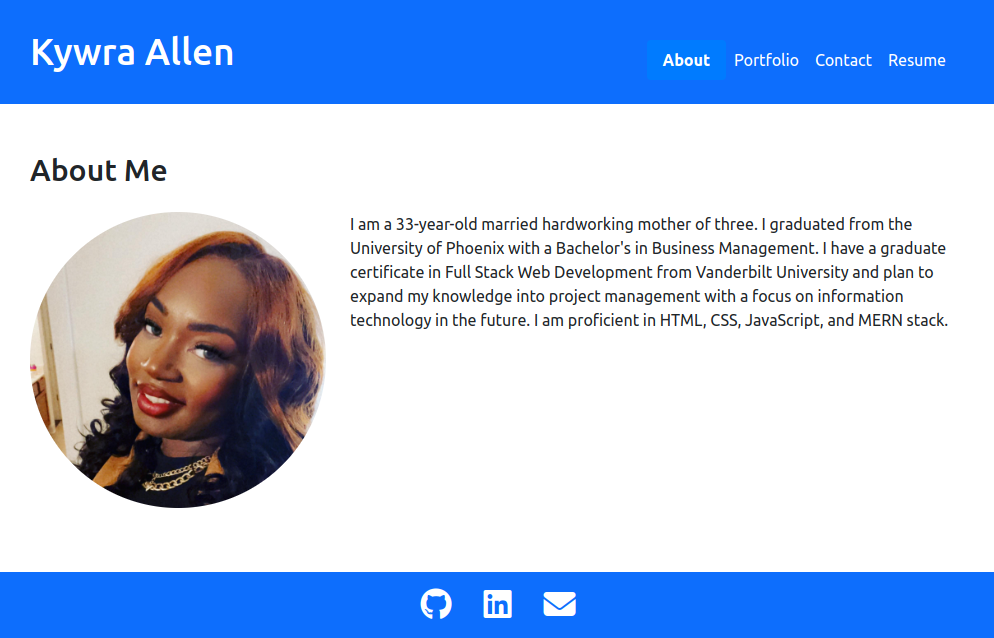

# Portfolio

This is my personal portfolio website showcasing my projects and skills. It was built using React and Bootstrap.

## Table of Contents

- [Portfolio](#portfolio)
  - [Table of Contents](#table-of-contents)
  - [About](#about)
  - [Portfolio](#portfolio-1)
  - [Contact](#contact)
  - [Resume](#resume)
  - [Getting Started](#getting-started)
  - [Deployment](#deployment)
  - [Contributing](#contributing)

## About

This portfolio website provides an overview of my background, skills, and projects. It includes sections for the about me, portfolio, contact form, and resume.

## Portfolio

The portfolio section displays a collection of my completed projects with links to their GitHub repositories and live demos. Each project is showcased with a brief description and relevant images.

## Contact

The contact section contains a form where visitors can send me a message. It captures the user's name, email address, and message, and allows them to send inquiries or feedback.

## Resume

The resume section contains a link to my updated resume. Visitors can download it to get a detailed overview of my skills, education, and work experience.

## Getting Started

To view the portfolio locally, follow these steps:

1. Clone the repository
2. Install dependencies: `npm install`
3. Start the development server: `npm start`
4. Open your browser and navigate to: `http://localhost:3000`

## Deployment

The portfolio is deployed to GitHub Pages.

## Contributing

Contributions are welcome! If you find any issues or want to suggest improvements, please feel free to open an issue or create a pull request.
